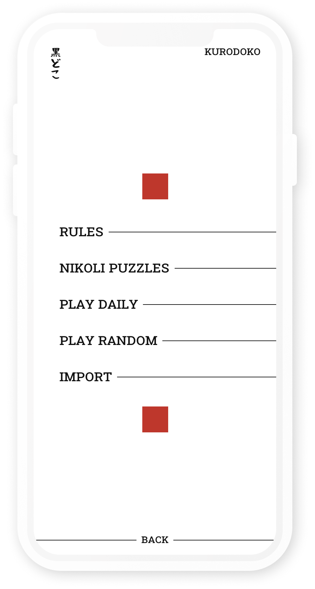
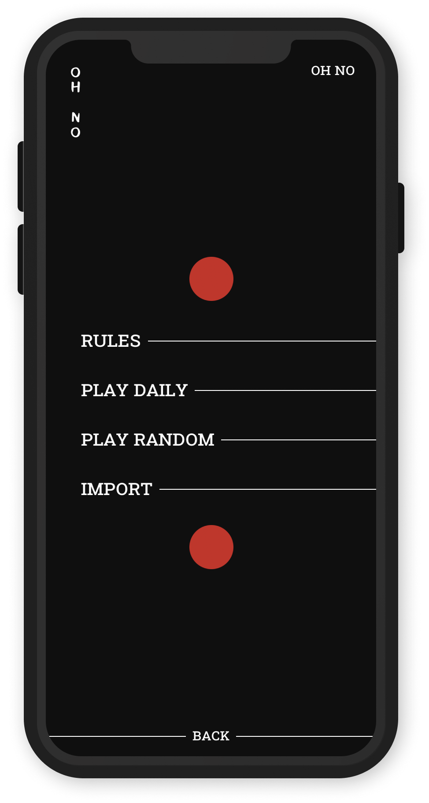
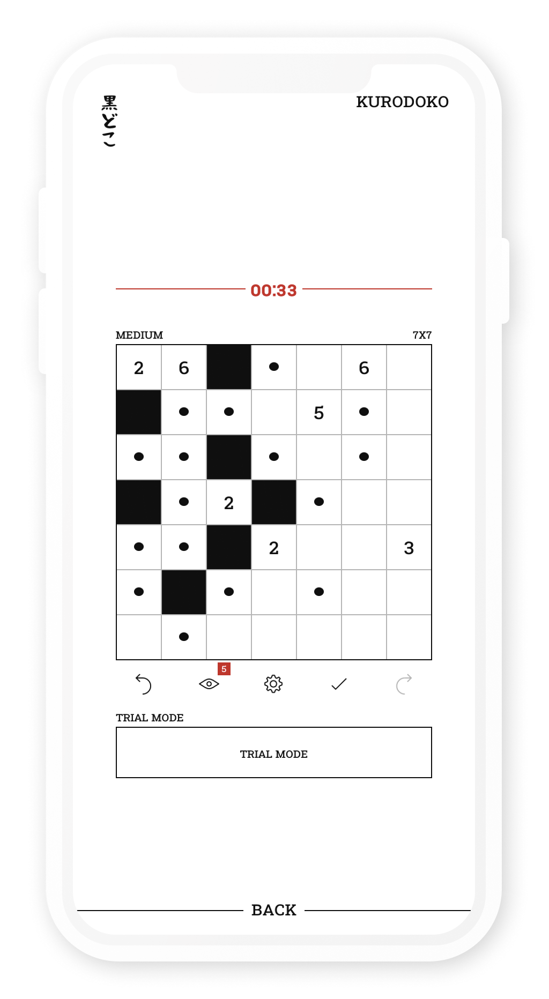

# Kurodoko

An web app for playing both _Kurodoko_ and _Ohno_, which is also available under [https://kurodoko.xyz](https://kurodoko.xyz).

<div style="display: flex; justify-content: space-evenly">
  
  
  
</div>

# Usage

In order to simply execute the application the Docker utility [`docker-compose`](https://docs.docker.com/compose/install/) can be used (from the terminal in the current directory): 

```
docker-compose -f docker-compose.yml.hub up
```

this will first download the prebuilt Docker Images and then run the application, such that the game is playable in the browser via the url [http://localhost:4444](http://localhost:4444). The application can be stopped using `Ctrl+C` and the containers can be removed using `docker-compose -f docker-compose.yml.hub down`.

The application can be built from source by using the command `docker-compose up` in the current directory.
This will first build the application from source (which may take some time) and then make it available under [http://localhost:4444/](http://localhost:4444/) in your web browser. Using `Ctrl+C` the the application can be stopped.
